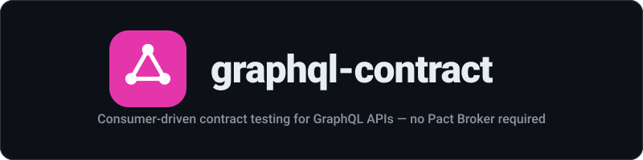

<div align="center">
  
</div>

<p align="center"><strong>Consumer-driven contract testing for GraphQL APIs — no Pact Broker required</strong></p>

<p align="center">
  <a href="https://github.com/mstuart/graphql-contract/actions/workflows/ci.yml"></a>
  <a href="https://www.npmjs.com/package/graphql-contract"></a>
  <a href="https://deepwiki.com/mstuart/graphql-contract"></a>
  <a href="https://socket.dev/npm/package/graphql-contract"></a>
</p>

---
Consumer-driven contract testing for GraphQL APIs using field selection sets. Frontend teams declare which fields they consume; backend CI fails if those fields change incompatibly. No Pact Broker server required — contracts are simple JSON files stored alongside your code.

## Installation

```bash
npm install graphql-contract --save-dev
# graphql is a peer dependency
npm install graphql
```

## Quick Start

### Consumer Side

In your frontend/consumer project, define and publish a contract:

```typescript
import { defineContract, publishContract } from 'graphql-contract';

const contract = defineContract({
  consumer: 'web-app',
  provider: 'user-service',
  operations: [
    `query GetUser {
      user(id: "1") {
        id
        email
        name
      }
    }`,
    `query GetUsers {
      users {
        id
        name
      }
    }`,
  ],
});

await publishContract(contract, {
  outputPath: './contracts/web-app.json',
});
```

### Provider Side

In your backend/provider project, verify contracts against your schema:

```typescript
import { buildSchema } from 'graphql';
import { verifyContracts } from 'graphql-contract';

const schema = buildSchema(`
  type Query {
    user(id: ID!): User!
    users: [User!]!
  }

  type User {
    id: ID!
    email: String!
    name: String!
  }
`);

const result = await verifyContracts({
  schema,
  contractsPath: './contracts',
});

if (!result.passed) {
  console.error('Contract violations found:');
  for (const v of result.violations) {
    console.error(`  ${v.field}: ${v.reason}`);
  }
  process.exit(1);
}

console.log('All contracts verified successfully.');
```

## API Reference

### `defineContract(opts)`

Creates a contract object.

| Parameter | Type | Description |
|-----------|------|-------------|
| `opts.consumer` | `string` | Name of the consuming service |
| `opts.provider` | `string` | Name of the provider service |
| `opts.operations` | `string[]` | GraphQL operation strings |

Returns a `GraphQLContract` object. Throws if any operation is syntactically invalid GraphQL.

### `publishContract(contract, opts)`

Writes a contract to a JSON file.

| Parameter | Type | Description |
|-----------|------|-------------|
| `contract` | `GraphQLContract` | The contract to publish |
| `opts.outputPath` | `string` | File path to write the JSON contract |

### `verifyContracts(opts)`

Verifies all contract JSON files in a directory against a GraphQL schema.

| Parameter | Type | Description |
|-----------|------|-------------|
| `opts.schema` | `GraphQLSchema` | The provider's GraphQL schema |
| `opts.contractsPath` | `string` | Path to directory containing contract JSON files |

Returns `{ passed: boolean; violations: ContractViolation[] }`.

### `checkOperationCompatibility(operation, schema)`

Low-level check for a single operation against a schema.

| Parameter | Type | Description |
|-----------|------|-------------|
| `operation` | `string` | A GraphQL operation string |
| `schema` | `GraphQLSchema` | The schema to check against |

Returns `ContractViolation[]`.

## How It Fits Into CI

1. **Consumer CI**: Run `defineContract` + `publishContract` to generate contract JSON files. Commit them to the provider repo or a shared contracts repo.

2. **Provider CI**: Run `verifyContracts` against your current schema. If any violations are found, the build fails before deployment.

```yaml
# Example GitHub Actions step (provider)
- name: Verify GraphQL contracts
  run: npx tsx scripts/verify-contracts.ts
```

This ensures backend teams cannot accidentally break fields that frontend teams depend on.

## License

MIT
